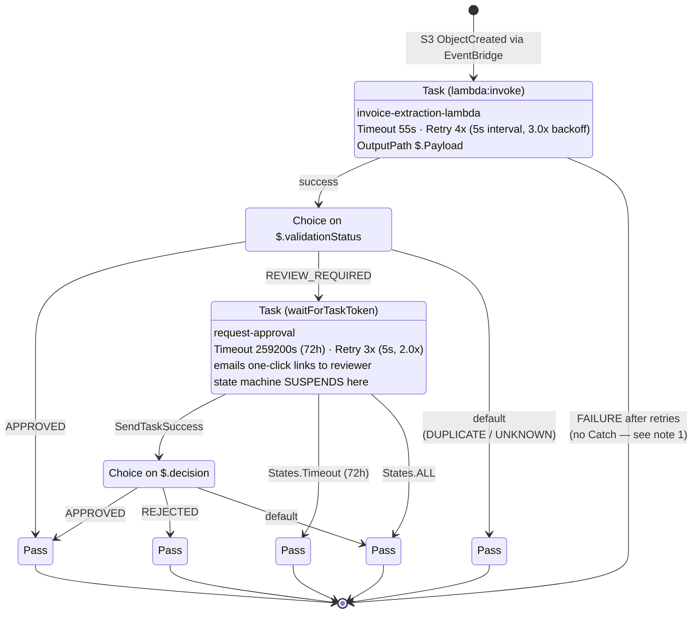

# InvoiceProcessingStateMachine — State Diagram

**Live resource:** `InvoiceProcessingStateMachine-hcaDdc2OYf7l`
**ARN:** `arn:aws:states:ap-south-1:891377127368:stateMachine:InvoiceProcessingStateMachine-hcaDdc2OYf7l`
**Type:** `STANDARD` · **Source:** `template.yaml:420-511`

---

## Diagram



---

## Text view

```
                    ┌──────────────────────────────────────────┐
   S3 upload        │                                          │
   ─────────► EventBridge ──► ProcessInvoice                   │
                    │   invoice-extraction-lambda             │
                    │   55s timeout, 4 retries @5s, 3.0x      │
                    │            │                             │
                    │            ▼                             │
                    │   CheckStatus  ($.validationStatus)     │
                    │     ├─ APPROVED ──────────────► Approved ─┐
                    │     ├─ REVIEW_REQUIRED ──► RequestApproval│
                    │     │                        (PAUSE 72h)  │
                    │     │                            │        │
                    │     │        SendTaskSuccess ◄───┤        │
                    │     │                            ▼        │
                    │     │                   DecisionOutcome   │
                    │     │                     ├─ APPROVED ─► Approved
                    │     │                     ├─ REJECTED ─► Rejected
                    │     │                     └─ default ──► RequestFailed
                    │     │                            │        │
                    │     │      States.Timeout (72h) ─► ApprovalTimedOut
                    │     │      States.ALL ──────────► RequestFailed
                    │     │                                     │
                    │     └─ default ─► ReviewOrDuplicate ──────┤
                    │                                           │
                    │   ✗ retry exhausted ──► EXECUTION FAILS ──┘
                    └──────────────────────────────────────────┘
```

---

## States

| State | Type | Purpose | Timeout | Retries | End states reachable |
|---|---|---|---|---|---|
| `ProcessInvoice` | Task | Textract + Bedrock extraction | 55 s | 4× (5 s, 3.0×) | — (**no Catch**) |
| `CheckStatus` | Choice | Branch on `$.validationStatus` | — | — | `Approved`, `RequestApproval`, `ReviewOrDuplicate` |
| `RequestApproval` | Task (`waitForTaskToken`) | Email reviewer, suspend 72 h | 259,200 s | 3× (5 s, 2.0×) | `DecisionOutcome`, `ApprovalTimedOut`, `RequestFailed` |
| `DecisionOutcome` | Choice | Branch on reviewer `$.decision` | — | — | `Approved`, `Rejected`, `RequestFailed` |
| `Approved` | Pass | Terminal | — | — | — |
| `Rejected` | Pass | Terminal | — | — | — |
| `ReviewOrDuplicate` | Pass | Terminal — DUPLICATE/UNKNOWN recorded | — | — | — |
| `ApprovalTimedOut` | Pass | Terminal — reviewer never answered | — | — | — |
| `RequestFailed` | Pass | Terminal — request-approval Lambda failed | — | — | — |

---

## The human-in-the-loop handshake

This is the part worth understanding before a presentation. The state machine is not just
orchestrating Lambdas — it **suspends and waits for a person**.

1. `CheckStatus` sees `REVIEW_REQUIRED` and routes to `RequestApproval`.
2. `RequestApproval` is a `waitForTaskToken` task. Step Functions generates a task token,
   passes it to `request-approval`, and **parks the execution**.
3. `RequestApprovalHandler` emails the reviewer one-click links that embed that token
   (`TokenApprovalHandler.java:153`).
4. The reviewer clicks → `TokenApprovalHandler` writes `reviewDecision` to DynamoDB and
   calls `SendTaskSuccess` with the decision (`TokenApprovalHandler.java:161`).
5. Step Functions resumes at `DecisionOutcome` and routes to `Approved` or `Rejected`.

A `RUNNING` execution in the console is therefore **normal and expected** whenever a
review is genuinely outstanding. It is not, by itself, a sign of a hang.

---

## Notes and discrepancies

**1. `ProcessInvoice` has no `Catch` — extraction failure fails the whole execution.**
`docs/ARCHITECTURE.md:105-107` states this state "catches `Lambda.ServiceException`,
`Lambda.AWSLambdaException`, `States.TaskFailed` → `RequestFailed` (state succeeds, workflow
ends)". There is no `Catch` on `ProcessInvoice` in `template.yaml:428-445`. After 4 failed
retries the execution transitions to `FAILED` and is not routed anywhere. Only
`RequestApproval` has a `Catch`.

**2. The documented retry policy does not match the template.**

| | `ARCHITECTURE.md:105` | `template.yaml:442-444` |
|---|---|---|
| Interval | 3 s | **5 s** |
| Backoff | 1.5 | **3.0** |
| Max attempts | 3 | **4** |
| Catch | claimed present | **absent** |

**3. The retry error list differs too.** The template retries on
`java.lang.RuntimeException`, `States.TaskFailed`, `Lambda.ServiceException`,
`Lambda.TooManyRequestsException`. The doc omits the first two and names
`Lambda.AWSLambdaException`, which the template does not list.

**4. There is a long-running execution in the live account.** As of 25 Sep 2026, one
execution has been `RUNNING` since 01:11 IST on a test PDF
(`invoices/b509e784-...-invoice_total_changed_for_testing.pdf`). It is inside the 72-hour
`RequestApproval` wait. It will resolve into `ApprovalTimedOut` when the timer expires.

---

## Related

- [`ARCHITECTURE.md`](ARCHITECTURE.md) — full system diagram and service inventory
- [`../template.yaml`](../template.yaml#L420-L511) — the ASL definition itself
- [`../src/main/java/com/invoice/processing/TokenApprovalHandler.java`](../src/main/java/com/invoice/processing/TokenApprovalHandler.java#L153-L165) — the `SendTaskSuccess` call
