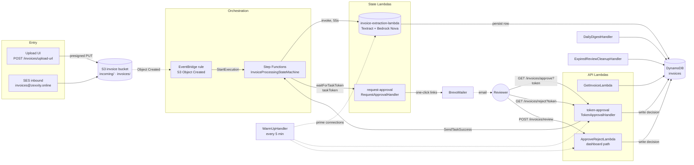
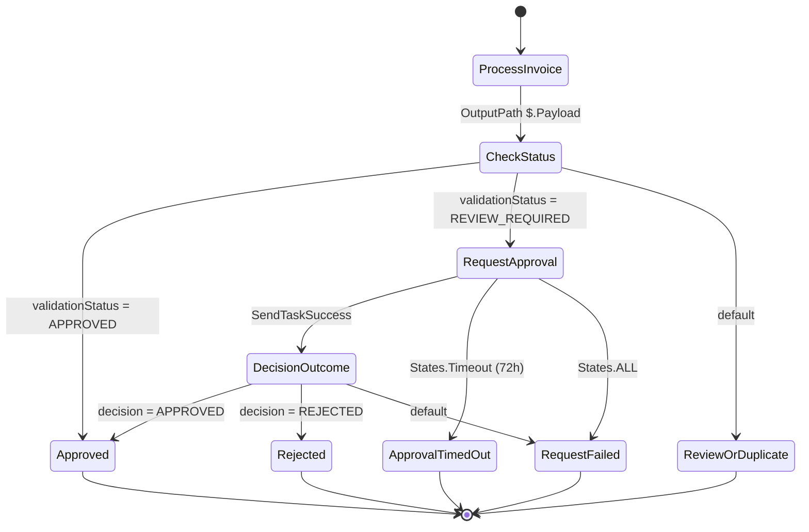
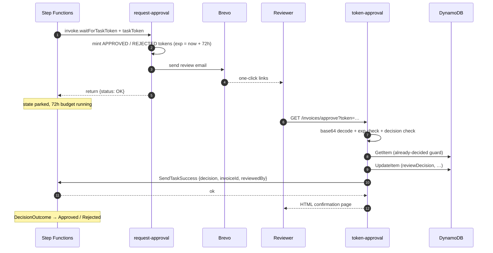

# Invoice Processing — State Machine Architecture

Canonical reference for the `InvoiceProcessingStateMachine` Step Functions
workflow: component topology, per-state contracts, retry and failure semantics,
and the human-approval handshake.

- **Definition source of truth:** [`../template.yaml`](../template.yaml) (lines 412–573)
- **Region / account:** `ap-south-1` (Mumbai), `891377127368`
- **Live name:** `InvoiceProcessingStateMachine-hcaDdc2OYf7l`
- **ARN:** `arn:aws:states:ap-south-1:891377127368:stateMachine:InvoiceProcessingStateMachine-hcaDdc2OYf7l`
- **Type:** `STANDARD` (execution/activity history retained, unlimited redrives)

> Handler behaviour in this document is described **as currently implemented**,
> not as intended. Where the two differ, the divergence is called out in
> [Known divergences](#known-divergences) rather than smoothed over.

---

## 1. Component topology



The state machine is **not** on the request path of the reviewer UI. The API
Gateway Lambdas read and write DynamoDB directly; only the
`token-approval` route participates in the workflow by resuming it.

---

## 2. Trigger

EventBridge `InvoiceUploadRule` (`template.yaml:535-554`) matches
`aws.s3` / `Object Created` for the invoice bucket, restricted to the
`incoming/` and `invoices/` key prefixes, and calls `states:StartExecution`
through `EventsToStatesRole`.

The execution input is the raw S3 event, so `ProcessInvoice` receives the
bucket/key of the uploaded object rather than an explicit payload.

---

## 3. State machine



### ASCII fallback

```
                     ┌──────────────────────────────────────────┐
  S3 Object Created  │            ProcessInvoice                │
  ──────────────────►  invoice-extraction-lambda · 55s · retry 4  │
                     │  OutputPath: $.Payload                    │
                     └───────────────────┬──────────────────────┘
                                         ▼
                                ┌──────────────────┐
                                │   CheckStatus    │
                                └────────┬─────────┘
             ┌───────────────────────────┼───────────────────────────┐
  APPROVED   │            REVIEW_REQUIRED│                           │ default
             ▼                           ▼                           ▼
      ┌────────────┐          ┌────────────────────────┐   ┌──────────────────┐
      │  Approved  │          │    RequestApproval     │   │ ReviewOrDuplicate│
      │   (Pass)   │          │ waitForTaskToken · 72h │   │      (Pass)      │
      └────────────┘          │ retry 3 · catch Timeout │   └──────────────────┘
                               └───────────┬────────────┘
                                 SendTaskSuccess│
             ┌─────────────────────────────┼──────────────────────────────┐
             │ States.Timeout              │ States.ALL                   │
             ▼                             ▼                              ▼
      ┌──────────────────┐        ┌──────────────────┐          ┌──────────────────┐
      │ ApprovalTimedOut │        │  RequestFailed   │          │  DecisionOutcome │
      │      (Pass)      │        │      (Pass)      │          └────────┬─────────┘
      └──────────────────┘        └──────────────────┘           ┌───────┴────────┐
                                                                  │ decision      │
                                                        APPROVED ──┘             └── REJECTED
                                                                    ▼                  ▼
                                                          ┌────────────┐      ┌────────────┐
                                                          │  Approved  │      │  Rejected  │
                                                          └────────────┘      └────────────┘
```

### State table

| State | Type | Target | Timeout | On success | On failure |
|---|---|---|---|---|---|
| `ProcessInvoice` | Task (`lambda:invoke`) | `invoice-extraction-lambda` | 55 s | `CheckStatus` | **No `Catch`** — retry exhaustion fails the execution |
| `CheckStatus` | Choice | — | — | `Approved` / `RequestApproval` / `ReviewOrDuplicate` | — |
| `RequestApproval` | Task (`lambda:invoke.waitForTaskToken`) | `request-approval` | 259 200 s (72 h) | `DecisionOutcome` | `States.Timeout`→`ApprovalTimedOut`; `States.ALL`→`RequestFailed` |
| `DecisionOutcome` | Choice | — | — | `Approved` / `Rejected` | default → `RequestFailed` |
| `Approved` | Pass | — | — | end | — |
| `Rejected` | Pass | — | — | end | — |
| `ApprovalTimedOut` | Pass | — | — | end | — |
| `RequestFailed` | Pass | — | — | end | — |
| `ReviewOrDuplicate` | Pass | — | — | end | — |

All five terminal states are bare `Pass` states. They record that the execution
finished, but they write nothing to DynamoDB and emit no notification — the
reviewer-facing row is updated only by the Lambda handlers, not by the
workflow.

---

## 4. Per-state contracts

### `ProcessInvoice` → `CheckStatus`

Invokes `invoice-extraction-lambda` with the S3 event as `Payload.$: "$"` and
unwraps the result with `OutputPath: "$.Payload"`.

The handler returns (at least) the fields the downstream states read:

| Field | Type | Used by |
|---|---|---|
| `validationStatus` | string | `CheckStatus` |
| `invoiceId` | string | `RequestApproval` |
| `risk` | string | `RequestApproval` (email body) |
| `comments` | string | `RequestApproval` (email body) |
| `totalConfidence` | number | `RequestApproval` (email body) |
| `avgConfidence` | number | `RequestApproval` (email body) |
| `sourceFileName` | string | `RequestApproval` (email body) |

`CheckStatus` matches on `validationStatus` as an exact string. Any value that
is not `APPROVED` or `REVIEW_REQUIRED` — including `DUPLICATE`, `UNKNOWN`,
a typo, or a missing field — falls to `Default` and ends at
`ReviewOrDuplicate` with no branch taken.

### `RequestApproval`

Forwards an explicit payload subset plus the task token:

```yaml
taskToken.$: "$$.Task.Token"
invoiceId.$: "$.invoiceId"
risk.$: "$.risk"
comments.$: "$.comments"
totalConfidence.$: "$.totalConfidence"
avgConfidence.$: "$.avgConfidence"
sourceFileName.$: "$.sourceFileName"
validationStatus.$: "$.validationStatus"
```

`RequestApprovalHandler` requires `taskToken` and `invoiceId` and throws
`IllegalArgumentException` otherwise. It then mints **two** tokens — one
`APPROVED`, one `REJECTED` — each carrying the same task token, and emails both
as one-click links.

### `DecisionOutcome`

Reads `decision` from the `SendTaskSuccess` output. `TokenApprovalHandler` sends:

```json
{ "decision": "APPROVED", "invoiceId": "…", "reviewedBy": "email-link" }
```

Anything other than `APPROVED` / `REJECTED` routes to `RequestFailed`.

---

## 5. Retry and failure semantics

| State | `IntervalSeconds` | `MaxAttempts` | `BackoffRate` | Error set | `Catch` |
|---|---|---|---|---|---|
| `ProcessInvoice` | 5 | 4 | 3.0 | `java.lang.RuntimeException`, `States.TaskFailed`, `Lambda.ServiceException`, `Lambda.TooManyRequestsException` | **none** |
| `RequestApproval` | 5 | 3 | 2.0 | `Lambda.ServiceException`, `Lambda.TooManyRequestsException`, `States.TaskFailed` | `States.Timeout`, `States.ALL` |

Consequences worth internalising:

1. **Extraction failure is fatal, not terminal-but-recorded.** `ProcessInvoice`
   has no `Catch`, so once the retry budget is spent the whole execution moves
   to `FAILED`. There is no dead-letter state and no compensating write — the
   DynamoDB row, if the handler wrote one before failing, is left as-is.
2. **`States.Timeout` is not retryable in `ProcessInvoice`.** A slow extraction
   that trips the 55 s state timeout is not in the error set, so it fails
   immediately with zero retries. The Lambda's own timeout is 60 s, so the last
   5 s of its budget can never be used.
3. **`RequestApproval` retries the *Lambda invocation*, not the human wait.**
   The retry block covers the `request-approval` call that sends the email. Once
   that Lambda returns, the state parks on the task token; the 72 h budget is
   enforced by `TimeoutSeconds` and surfaces via the `States.Timeout` catch.
4. **`RequestApproval`'s `States.ALL` catch swallows the error.** A
   `request-approval` failure after retries lands in `RequestFailed`, an
   `End: true` `Pass` state. The execution therefore reports **SUCCEEDED** even
   though the approval request was never delivered.
5. **Email failure never fails the state.** `RequestApprovalHandler` catches
   Brevo errors and only logs a `WARNING` (deliberate — see the in-code
   comment). The state succeeds and parks, but no one receives the links.

### Observed execution

One execution was left `RUNNING` far beyond its window during verification:

- `InvoiceProcessingStateMachine-hcaDdc2OYf7l`
- `ca6aef88-c236-68c0-c066-049d71fe4c7c_467b8171-742b-0aef-5285-c4beb54d83f4`
- Started `2026-09-25T01:11:50.196+05:30`
- Source key `invoices/b509e784-4da1-4207-99b8-53695497b392-invoice_total_changed_for_testing.pdf`
- Parked in `RequestApproval`, consistent with the 72 h budget rather than a fault.

---

## 6. Human approval flow

There are **two** reviewer paths. Only one of them resumes the state machine.



### Path A — one-click email link (resumes the workflow)

`GET /invoices/approve?token=…` and `GET /invoices/reject?token=…` both route to
`token-approval` (`TokenApprovalHandler`, 512 MB / 30 s).

1. **Decode.** The token is URL-safe Base64 (no padding) of
   `{"invoiceId","decision","exp","taskToken"}`.
2. **Validate.** Rejects `exp` in the past, and any `decision` outside
   `APPROVED` / `REJECTED`, with an HTML error page.
3. **Idempotency guard.** `GetItem` on the invoice; if a non-blank
   `reviewDecision` already exists it returns an "Already Decided" page and
   stops.
4. **Persist.** `UpdateItem` sets `reviewDecision`, `validationStatus`,
   `reviewedAt`, `reviewedBy = "email-link"`, and `reviewNote`.
5. **Resume.** If the token carried a `taskToken`, calls
   `states:SendTaskSuccess` with the decision payload.
6. **Respond.** Returns a styled HTML confirmation.

### Path B — reviewer dashboard (does **not** resume the workflow)

`POST /invoices/review` (`ApproveRejectHandler`, 512 MB / 30 s) is what the
React UI calls. It validates `invoiceId` and `decision`, then runs the DynamoDB
write and a Brevo confirmation email concurrently via
`CompletableFuture.allOf(…, 15 s)`.

**It has no Step Functions client and never calls `SendTaskSuccess`.**

The review email explicitly offers this route as an alternative —

> Or review with full details in the dashboard: `<frontend>/review?id=…`

— so a reviewer who takes the advertised path records their decision in
DynamoDB while the execution stays parked in `RequestApproval` until the 72 h
`States.Timeout` fires and the run lands in `ApprovalTimedOut`. The invoice row
and the workflow state then disagree: the UI shows the decision, the execution
history shows a timeout.

Escalation links are a third, narrower case.
`ExpiredReviewCleanupHandler` mints tokens for expired reviews **without** a
task token, so `TokenApprovalHandler` writes the decision and skips step 5.
That is consistent — the execution has already timed out — but it means those
links are record-only.

---

## 7. Persistence and idempotency

| Property | Current behaviour |
|---|---|
| Write type | Bare `UpdateItem`, **no condition expression**, on both approval paths |
| Missing invoice | The `UpdateItem` **creates** the item — both routes can invent rows |
| Re-decision | `TokenApprovalHandler` guards with `GetItem`; `ApproveRejectHandler` does not guard at all and will overwrite an existing decision |
| Partial failure | DynamoDB write happens **before** `SendTaskSuccess`; if the resume then fails, the decision is already stored |
| Recovery | A repeat click hits the "Already Decided" branch and returns early — it **never retries the resume** |
| Note text | `TokenApprovalHandler` hard-codes `reviewNote = "Approved via email link"` even for rejections |

The partial-failure case is the sharpest edge: DynamoDB write succeeds →
`SendTaskSuccess` throws (e.g. the task token already expired) → the exception
is caught and logged as a `WARNING` → the reviewer still sees
"Invoice Approved ✅". The decision is durable, the workflow is stranded, and
nothing in the response or the row reveals the split.

Both phantom-row behaviours were reproduced against the live table during load
testing and are tracked in
[`load-test-results.md`](load-test-results.md#7-defects-found-by-this-test).

---

## 8. Security notes

- **Tokens are signed by nothing.** `buildToken` is plain
  `Base64.getUrlEncoder().withoutPadding()` over a JSON object. There is no
  HMAC, no signature, and no server-side record. Anyone holding a link can
  decode it, read the embedded SFN **task token**, and re-encode a token with an
  arbitrary `invoiceId` and `decision`.
- **Expiry is self-asserted.** `exp` is honoured because the server believes it;
  there is nothing to check it against. Combined with the above, an attacker
  can mint a token with any `exp`.
- **Task-token authority travels in a URL.** The link is an email `GET`, so it
  is exposed to mailboxes, proxy logs, and `Referer` headers.
- **No authentication on the approval API.** The reviewer routes are reachable
  by anyone who obtains or forges a token; `POST /invoices/review` accepts any
  `invoiceId` with no identity check.
- **Single reviewer address.** Review and escalation mail go to one configured
  `getSesReviewer()` address, so "no login required" is a shared capability
  rather than an authenticated one.

The `getSesReviewer()` naming is itself stale — the field feeds Brevo, not SES.

---

## 9. Known divergences

| # | Severity | Finding | Evidence |
|---|---|---|---|
| 1 | **High** | Dashboard approval (`POST /invoices/review`) never calls `SendTaskSuccess`, so the advertised "review in the dashboard" path strands the execution for 72 h and ends in `ApprovalTimedOut`. | `ApproveRejectHandler.java` (no `software.amazon.awssdk.services.sfn` import); `RequestApprovalHandler.java:77` |
| 2 | **High** | Approval tokens are unsigned Base64 carrying the SFN task token — forgeable, and expiry is self-asserted. | `RequestApprovalHandler.java:103-115`, `TokenApprovalHandler.java:89-103` |
| 3 | **High** | Both approval routes use unconditional `UpdateItem` and create rows for invoices that do not exist. | `ApproveRejectHandler.java:99-109`, `TokenApprovalHandler.java:137-147` |
| 4 | **High** | `SendTaskSuccess` failures are swallowed; the reviewer sees success while the workflow is stranded, and re-clicking cannot recover it. | `TokenApprovalHandler.java:167-170`, `:118-127` |
| 5 | Medium | `ProcessInvoice` has no `Catch`; extraction failure ends in `FAILED` with no dead-letter or notification. | `template.yaml:428-445` |
| 6 | Medium | `States.Timeout` is absent from `ProcessInvoice`'s retry set, and the 55 s state timeout pre-empts the Lambda's 60 s budget, so slow extractions get no retry. | `template.yaml:435-444`, `template.yaml:192` |
| 7 | Medium | `RequestApproval`'s `States.ALL` catch routes email failure to a successful `RequestFailed` `Pass` state, so the run reports `SUCCEEDED`. | `template.yaml:479-485`, `:506-508` |
| 8 | Medium | Review email failure is swallowed by design; combined with finding 1 that leaves no path to resume. | `RequestApprovalHandler.java:82-90` |
| 9 | Low | `reviewNote` reads "Approved via email link" for rejections too. | `TokenApprovalHandler.java:135` |
| 10 | Low | Comments/Javadocs say SES; all sending goes through `BrevoMailer`. `TokenApprovalHandler` also credits `InvoiceExtractionHandler` with minting tokens, which is `RequestApprovalHandler`'s job. | `TokenApprovalHandler.java:22-33`, `ApproveRejectHandler.java:81,147` |
| 11 | Low | Token `exp` is computed inside the Lambda, marginally after the state was entered, so a link can outlive the 72 h state timeout by seconds. | `RequestApprovalHandler.java:47`, `template.yaml:470` |

### Suggested remediation order

1. Resume the workflow from the dashboard path (finding 1) — it is the only one
   that silently corrupts normal reviewer behaviour.
2. Sign the token with HMAC and stop embedding the raw task token in the link
   (finding 2); store the task token server-side, keyed by a random token id.
3. Add `attribute_exists(invoiceId)` condition expressions to both write paths
   and re-verify against the live table (finding 3).
4. Call `SendTaskSuccess` before responding, and make the already-decided guard
   re-attempt a pending resume rather than short-circuit (finding 4).
5. Add a `Catch` to `ProcessInvoice` with a real failure state, and add
   `States.Timeout` to its retry set (findings 5–6).

---

## 10. Operational reference

| Item | Value |
|---|---|
| API base | `https://xei4kla8v8.execute-api.ap-south-1.amazonaws.com` |
| Reviewer dashboard | `https://zexxity.online/review` |
| DynamoDB table | `invoices` (`ap-south-1`) |
| Extraction Lambda | `invoice-extraction-lambda`, 2048 MB, 60 s timeout |
| `request-approval` | 512 MB, 30 s timeout |
| `token-approval` | 512 MB, 30 s timeout, `$default` stage alias `live` |
| `ApproveRejectLambda` | 512 MB, 30 s timeout, alias `live` |
| EventBridge rule | `InvoiceUploadRule` → `StartExecution` via `EventsToStatesRole` |
| State machine role | `StateMachineRole` — `lambda:InvokeFunction` on extraction + `request-approval` only |
| Warm-up | `lambda-warm` every 5 min primes DynamoDB connections |
| Email provider | Brevo (`BrevoMailer`), sender from Secrets Manager |

All handlers pin `Region.AP_SOUTH_1` (`ap-south-1`, Mumbai) explicitly rather
than relying on the Lambda runtime's `AWS_REGION`; `ap-southeast-1` is a
different region and does not appear in the deployed build.

---

## 11. Source references

- [`../template.yaml`](../template.yaml) — state machine, roles, routes, trigger
- [`../src/main/java/com/invoice/processing/RequestApprovalHandler.java`](../src/main/java/com/invoice/processing/RequestApprovalHandler.java) — token minting, review email
- [`../src/main/java/com/invoice/processing/TokenApprovalHandler.java`](../src/main/java/com/invoice/processing/TokenApprovalHandler.java) — link handling, DynamoDB write, `SendTaskSuccess`
- [`../src/main/java/com/invoice/processing/ApproveRejectHandler.java`](../src/main/java/com/invoice/processing/ApproveRejectHandler.java) — dashboard decision path
- [`../src/main/java/com/invoice/processing/InvoiceExtractionHandler.java`](../src/main/java/com/invoice/processing/InvoiceExtractionHandler.java) — extraction output contract
- [`../src/main/java/com/invoice/processing/ExpiredReviewCleanupHandler.java`](../src/main/java/com/invoice/processing/ExpiredReviewCleanupHandler.java) — escalation links without task tokens
- [`ARCHITECTURE.md`](ARCHITECTURE.md) — system overview
- [`load-test-results.md`](load-test-results.md) — measured behaviour and integrity findings
- [`state-machine-diagram.md`](state-machine-diagram.md) — original diagram note
